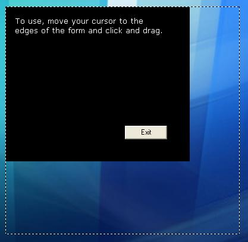



## Outline Form Resize

### Description

If you've ever tried to skin you app you'll most likely have noticed that when you resize the form you get a lot of flickering from the graphics. This code provides a method of resizing the form without all the flickering!

When you resize the form using this code, an outline is shown and the form is resized when the mouse is released. The outline will also snap back to the existing size of the form and to the edges of the screen.

Don't forget to vote if you like it =)
 
### More Info
 
To use simply move your cursor to the edges/corners of the form and click and drag. The outline will show the new size of the form, when you release the mouse the form will resize.

             |
---                |---
**Submitted On**   |2003-11-01 12:39:28
**By**             |[Ed Jones](https://github.com/Planet-Source-Code/PSCIndex/blob/master/ByAuthor/ed-jones.md)
**Level**          |Advanced
**User Rating**    |5.0 (15 globes from 3 users)
**Compatibility**  |VB 6\.0
**Category**       |[Custom Controls/ Forms/  Menus](https://github.com/Planet-Source-Code/PSCIndex/blob/master/ByCategory/custom-controls-forms-menus__1-4.md)
**World**          |[Visual Basic](https://github.com/Planet-Source-Code/PSCIndex/blob/master/ByWorld/visual-basic.md)
**Archive File**   |[Outline\_Fo1724603252004\.zip](https://github.com/Planet-Source-Code/ed-jones-outline-form-resize__1-52651/archive/master.zip)

